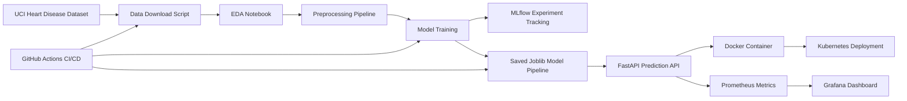

# Heart Disease Prediction MLOps Pipeline

### **Course:** Machine Learning Operations AIMLCZG523  

### **Assignment:** Assignment 01  

### **Student Name:** ANKITA GOPAKUMAR MEENAKSHI

### **Student ID:** 2024AC05600

### **GitHub Repository:** https://github.com/Ankita-BITS/ML-OPS-Assignment/tree/main/heart-disease-mlops

---

## 1. Project Overview

This project implements an end-to-end Machine Learning Operations pipeline for predicting the risk of heart disease using the Heart Disease UCI dataset. The objective is to build a reproducible machine learning classifier and deploy it as a monitored API.

The project covers the complete MLOps lifecycle:

- Data acquisition and exploratory data analysis
- Data preprocessing and feature engineering
- Model training and evaluation
- Hyperparameter tuning
- Experiment tracking using MLflow
- Model packaging and reproducibility
- API development using FastAPI
- Docker containerization
- CI/CD using GitHub Actions
- Kubernetes deployment
- Monitoring and logging using Prometheus and Grafana

The final output is a containerized API that accepts patient health information as JSON input and returns a heart disease prediction along with a confidence probability.

---

## 2. Problem Statement

The goal of this project is to build a binary classification model that predicts whether a patient is likely to have heart disease based on clinical attributes such as age, sex, chest pain type, resting blood pressure, cholesterol, maximum heart rate, exercise-induced angina, and other health-related features.

The target variable is converted into a binary format:

- `0`: No heart disease
- `1`: Heart disease present

This makes the problem suitable for supervised binary classification.

---

## 3. Project Architecture

The overall MLOps workflow is shown below.

### Data Acquisition and Exploratory Data Analysis

The Heart Disease UCI dataset was obtained from the UCI Machine Learning Repository. The dataset contains clinical variables such as age, sex, chest pain type, resting blood pressure, cholesterol, fasting blood sugar, resting ECG results, maximum heart rate, exercise-induced angina, oldpeak, slope, number of major vessels, thalassemia status, and a heart disease diagnosis target.

The original target variable contains values from 0 to 4. For this project, the target was converted into a binary classification label, where 0 represents absence of heart disease and 1 represents presence of heart disease. This aligns with the assignment objective of building a binary classifier for heart disease risk prediction.

Exploratory Data Analysis was performed to understand data quality, feature distributions, class balance, and relationships between predictors and the target variable. Missing value analysis was conducted to identify incomplete records. Histograms were used to review numerical feature distributions. A correlation heatmap was generated to evaluate relationships between numerical variables. Class distribution plots were used to assess target balance. Boxplots and grouped count plots were used to compare feature behavior across the two target classes.

The EDA showed that the dataset is suitable for binary classification after preprocessing. Missing values and feature transformations will be handled using a reproducible sklearn preprocessing pipeline during model development.

### Feature Engineering and Model Development

Feature engineering and model development were implemented using reproducible sklearn pipelines. The dataset was split into training and test sets using stratified sampling to preserve the class distribution of the binary target variable.

The input features were divided into numerical and categorical feature groups. Numerical features included age, resting blood pressure, cholesterol, maximum heart rate, and oldpeak. These features were imputed using median imputation and scaled using StandardScaler. Categorical features included sex, chest pain type, fasting blood sugar, resting ECG results, exercise-induced angina, slope, number of major vessels, and thalassemia status. These features were imputed using the most frequent value and encoded using OneHotEncoder.

Two classification models were trained and compared: Logistic Regression and Random Forest Classifier. Logistic Regression was used as an interpretable baseline model, while Random Forest was used as a nonlinear ensemble model capable of capturing feature interactions.

Hyperparameter tuning was performed using GridSearchCV with stratified 5-fold cross-validation. ROC-AUC was used as the primary tuning metric because it evaluates the model's discrimination ability across classification thresholds. Final model performance was evaluated on a held-out test set using accuracy, precision, recall, F1-score, and ROC-AUC.

The best-performing model was selected based on test ROC-AUC and saved as a complete sklearn pipeline. This pipeline includes both preprocessing and the trained classifier, making it reusable for future inference and API deployment.

### Experiment Tracking

MLflow was integrated into the model training workflow to support reproducibility, traceability, and experiment comparison. Each model training run was logged as a separate MLflow run under the experiment named `heart_disease_classification`.

For each model, the training pipeline logged model parameters, best hyperparameters from GridSearchCV, cross-validation ROC-AUC, test accuracy, precision, recall, F1-score, and test ROC-AUC. Evaluation artifacts such as confusion matrix plots and ROC curve plots were also logged.

The trained sklearn pipeline was saved to MLflow as a model artifact. This pipeline includes both preprocessing and the trained classifier, which ensures that the same transformation logic is applied during future inference.

A final MLflow run was also created for the selected model. This run logged the selected model name, final test ROC-AUC, model comparison report, feature metadata, and the final trained pipeline.

Using MLflow made it possible to compare Logistic Regression and Random Forest experiments in a centralized interface and select the best-performing model based on objective evaluation metrics.

### Model Packaging and Reproducibility

The final model was packaged as a complete sklearn pipeline and saved in Joblib format. The saved pipeline includes both preprocessing and the trained classifier. This design ensures that the same missing value imputation, numerical scaling, categorical encoding, and classification logic are applied consistently during training and inference.

The preprocessing pipeline was implemented using `ColumnTransformer`. Numerical features were handled using median imputation and standard scaling. Categorical features were handled using most frequent value imputation and one-hot encoding. The classifier was attached to the preprocessing pipeline using sklearn `Pipeline`.

The final packaged model was saved as:

`model/heart_disease_pipeline.joblib`

Additional metadata was saved in:

`model/feature_metadata.json`

A sample prediction input was saved in:

`model/sample_input.json`

A separate prediction script, `src/predict.py`, was created to verify that the packaged model can be loaded and used independently. The script accepts JSON input, applies the saved preprocessing and model pipeline, and returns the predicted class along with the confidence probability.

Project dependencies were captured in `requirements.txt`, and the recommended Python environment was documented using `environment.yml`. This supports reproducibility by allowing the project to be installed and executed in a clean environment.

### CI/CD Pipeline and Automated Testing

Automated testing and continuous integration were implemented to improve code quality and reproducibility. Unit tests were written using Pytest to validate the cleaned dataset, preprocessing pipeline, saved model package, and prediction output structure.

The preprocessing tests verify that the sklearn `ColumnTransformer` can fit and transform sample input data, including missing values. The data tests verify that the processed dataset exists, contains the target column, contains records, and uses a binary target label. The prediction tests verify that the saved model file and sample input exist and that the prediction script returns a valid prediction, class label, and confidence probability.

A GitHub Actions workflow was created under `.github/workflows/ci.yml`. The workflow runs automatically on push, pull request, or manual execution. It sets up Python 3.11, installs dependencies, runs Flake8 linting, downloads the dataset, trains the model, validates the prediction pipeline, runs unit tests, and uploads model/report artifacts.

This CI/CD setup ensures that code errors, test failures, or model packaging failures are detected early. The workflow is configured to fail if linting or unit tests fail, which aligns with production-readiness expectations for an MLOps project.

### Model Containerization

The trained heart disease prediction model was containerized using Docker. A FastAPI application was created to serve the model through a REST API. The API exposes a `/predict` endpoint that accepts patient health data in JSON format and returns the predicted class, prediction label, heart disease probability, and confidence probability.

The Docker image includes the FastAPI application code, trained sklearn pipeline, model metadata, and Python dependencies. The saved sklearn pipeline contains both preprocessing and the trained classifier, ensuring that inference inside the container uses the same transformation logic used during training.

The Docker container was built locally and executed using port mapping from container port 8000 to host port 8000. The API was verified using the FastAPI Swagger UI, `/health` endpoint, and a sample `/predict` request.

### Production Deployment

The Dockerized heart disease prediction API was deployed to local Kubernetes using Docker Desktop Kubernetes. This deployment approach satisfies the production deployment requirement by running the model-serving API in an orchestrated environment rather than as a standalone local process.

The Kubernetes deployment consists of three manifest files: a namespace manifest, a deployment manifest, and a service manifest. The deployment runs two replicas of the FastAPI container using the locally built `heart-disease-api:latest` Docker image. Readiness and liveness probes were configured to call the `/health` endpoint, allowing Kubernetes to check whether the API is available and healthy.

A Kubernetes LoadBalancer service was created to expose the API on port 8000. The deployed API was verified using the `/health` endpoint, the `/predict` endpoint, and the FastAPI Swagger UI. A sample JSON request was submitted to the `/predict` endpoint, and the API returned the predicted heart disease class, prediction label, heart disease probability, and confidence probability.

This deployment demonstrates that the trained model can be served from a containerized API in a Kubernetes environment with repeatable deployment configuration.

### Monitoring and Logging

Basic monitoring and logging were implemented for the heart disease prediction API. The FastAPI application logs incoming API requests, including request method, endpoint path, response status code, and request duration. The `/predict` endpoint also logs prediction completion and the predicted heart disease probability.

Prometheus metrics were integrated using `prometheus-fastapi-instrumentator`. This exposes a `/metrics` endpoint from the FastAPI service. The metrics endpoint provides HTTP request metrics that can be scraped by Prometheus.

A Docker Compose monitoring setup was created to run the model-serving API, Prometheus, and Grafana together. Prometheus was configured to scrape the API `/metrics` endpoint every 5 seconds. The Prometheus targets page was used to verify that the API monitoring target was healthy and in the `UP` state.

Grafana was included as an optional visualization layer. Prometheus can be added as a Grafana data source to support dashboard-based monitoring of API request counts, latency, and service availability.

This monitoring setup provides basic observability for the deployed model API and helps detect API downtime, request failures, and performance degradation.