# Heart Disease Prediction MLOps Pipeline

### **Course:** Machine Learning Operations AIMLCZG523  

### **Assignment:** Assignment 01  

### **Student Name:** ANKITA GOPAKUMAR MEENAKSHI

### **Student ID:** 2024AC05600

### **GitHub Repository:**  https://github.com/Ankita-BITS/heart-disease-mlops
 
<br>

## Executive Summary

This project implements an end-to-end MLOps pipeline for predicting heart disease risk using the Heart Disease UCI dataset. The workflow includes data acquisition, exploratory data analysis, preprocessing, model development, experiment tracking, model packaging, API serving, Docker containerization, CI/CD automation, Kubernetes deployment, and monitoring.

The final solution serves a trained machine learning model through a FastAPI application. The API accepts patient health data as JSON input and returns a predicted heart disease class with a confidence probability. The application was containerized using Docker, deployed locally using Kubernetes, and monitored using Prometheus-compatible metrics and API request logs.

---

# 1. Problem Statement and Objective

The objective of this assignment is to design, develop, and deploy a reproducible machine learning solution using modern MLOps practices.

The problem is a binary classification task:

| Target Value | Meaning |
|---:|---|
| `0` | No heart disease |
| `1` | Heart disease present |

The model predicts heart disease risk using patient-level clinical features such as age, sex, chest pain type, resting blood pressure, cholesterol, fasting blood sugar, resting ECG results, maximum heart rate, exercise-induced angina, ST depression, slope, number of major vessels, and thalassemia status.

---

# 2. Solution Architecture

The project follows a modular MLOps workflow. Each stage is implemented as a reusable component so the system can be retrained, tested, packaged, deployed, and monitored consistently.

```text
+-----------------------------+
| Heart Disease UCI Dataset   |
+-------------+---------------+
              |
              v
+-----------------------------+
| Data Download and Cleaning  |
| src/download_data.py        |
+-------------+---------------+
              |
              v
+-----------------------------+
| EDA and Visualization       |
| notebooks/01_eda.ipynb      |
+-------------+---------------+
              |
              v
+-----------------------------+
| Preprocessing Pipeline      |
| ColumnTransformer + Pipeline|
+-------------+---------------+
              |
              v
+-----------------------------+
| Model Training and Tuning   |
| Logistic Regression         |
| Random Forest               |
+-------------+---------------+
              |
              v
+-----------------------------+
| MLflow Experiment Tracking  |
| Parameters, metrics, plots  |
+-------------+---------------+
              |
              v
+-----------------------------+
| Packaged Model Pipeline     |
| model/*.joblib              |
+-------------+---------------+
              |
              v
+-----------------------------+
| FastAPI Prediction API      |
| /health /predict /metrics   |
+-------------+---------------+
              |
              v
+-----------------------------+
| Docker + Kubernetes         |
| Containerized deployment    |
+-------------+---------------+
              |
              v
+-----------------------------+
| Monitoring and Logging      |
| Prometheus + Grafana        |
+-----------------------------+
```
<div style="page-break-after: always;"></div>
---

# 3. Repository Structure

```text
heart-disease-mlops/
├── api/
│   ├── __init__.py
│   └── app.py
├── data/
│   ├── raw/
│   └── processed/
├── deployment/
│   ├── namespace.yaml
│   ├── deployment.yaml
│   └── service.yaml
├── model/
│   ├── heart_disease_pipeline.joblib
│   ├── feature_metadata.json
│   └── sample_input.json
├── monitoring/
│   └── prometheus.yml
├── notebooks/
│   ├── 01_eda.ipynb
│   └── 02_modeling.ipynb
├── reports/
│   ├── figures/
│   ├── model_comparison.csv
│   └── final_report.md
├── screenshots/
├── src/
│   ├── download_data.py
│   ├── preprocessing.py
│   ├── train.py
│   └── predict.py
├── tests/
├── .github/workflows/ci.yml
├── Dockerfile
├── docker-compose.monitoring.yml
├── requirements.txt
├── requirements-docker.txt
├── environment.yml
└── README.md
```

<div style="page-break-after: always;"></div>

# 4. Data Acquisition and Exploratory Data Analysis

The dataset was downloaded using `src/download_data.py`. The original target variable was converted into a binary target where `0` represents no heart disease and values greater than `0` represent heart disease presence.

The cleaned dataset was saved as:

```text
data/processed/heart_disease_clean.csv
```

EDA was performed in:

```text
notebooks/01_eda.ipynb
```

## 4.1 EDA Activities

The EDA covered the following:

| EDA Area | Purpose |
|---|---|
| Dataset preview | Confirm structure and columns |
| Data types | Identify numerical and categorical variables |
| Summary statistics | Review feature ranges and spread |
| Missing value analysis | Identify incomplete records |
| Class distribution | Check target balance |
| Histograms | Review numerical feature distributions |
| Correlation heatmap | Identify feature relationships |
| Boxplots/count plots | Compare features against target |

## 4.2 Missing Value Analysis

Missing values were reviewed during EDA but not permanently imputed in the dataset. Missing value handling was implemented later inside the sklearn preprocessing pipeline to avoid data leakage.

<p align="center">
  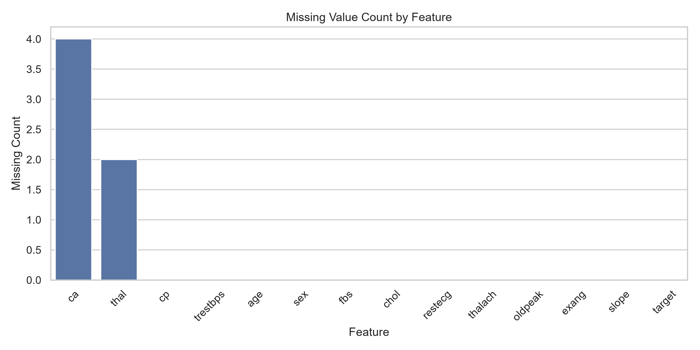
</p>

<p align="center"><b>Figure 1.</b> Missing value count by feature.</p>

## 4.3 Class Distribution

The target distribution was reviewed to understand class balance before training. Since this is a health-related prediction problem, accuracy alone was not treated as sufficient. Precision, recall, F1-score, and ROC-AUC were also used.

<p align="center">
  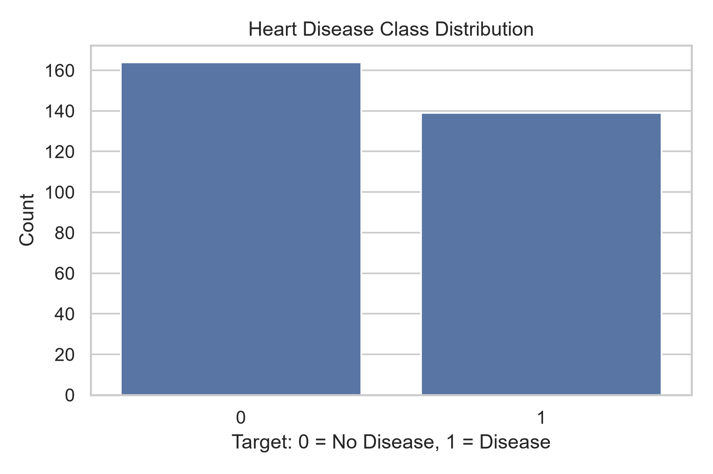
</p>

<p align="center"><b>Figure 2.</b> Heart disease target class distribution.</p>

## 4.4 Feature Distributions and Correlation

Histograms were used to review numerical distributions, and a correlation heatmap was used to study feature relationships.

<p align="center">
  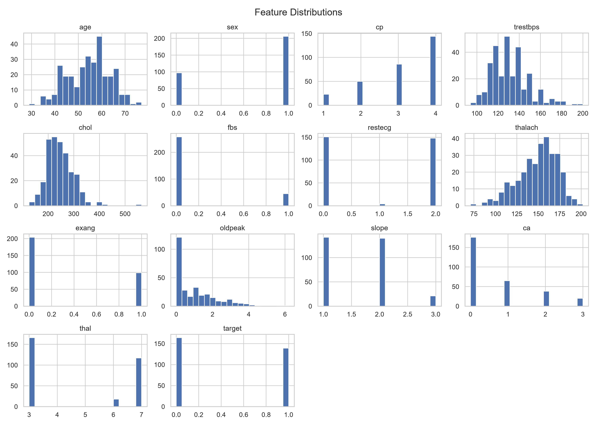
</p>

<p align="center"><b>Figure 3.</b> Numerical feature distributions.</p>

<p align="center">
  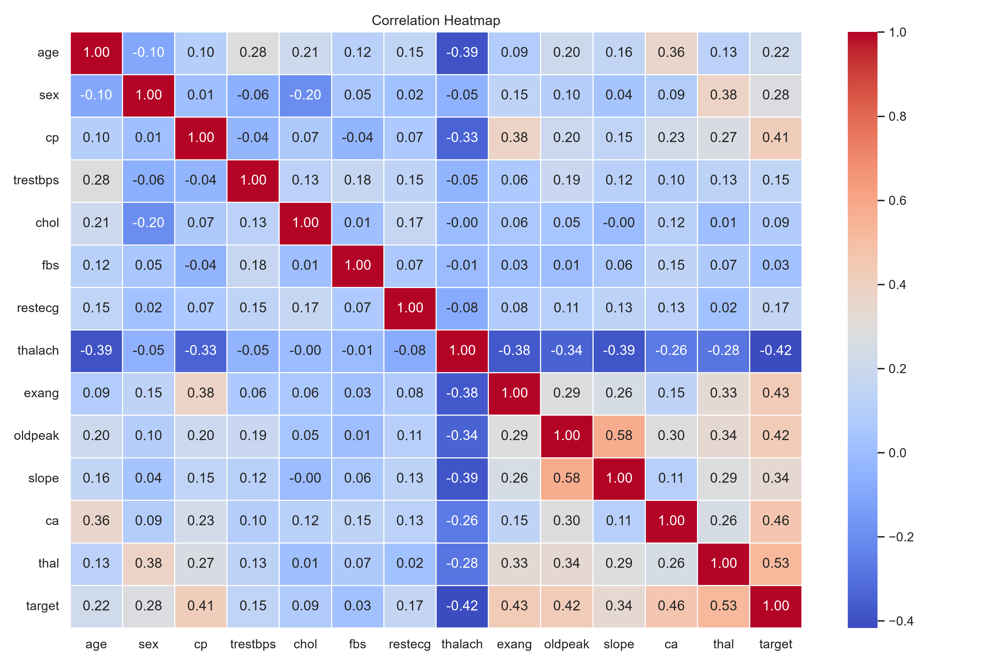
</p>

<p align="center"><b>Figure 4.</b> Correlation heatmap.</p>
<div style="page-break-after: always;"></div>

---
# 5. Feature Engineering and Preprocessing

Preprocessing was implemented in `src/preprocessing.py` using sklearn `Pipeline` and `ColumnTransformer`.

## 5.1 Numerical Features

| Feature | Description |
|---|---|
| `age` | Patient age |
| `trestbps` | Resting blood pressure |
| `chol` | Serum cholesterol |
| `thalach` | Maximum heart rate achieved |
| `oldpeak` | ST depression induced by exercise |

Numerical preprocessing steps:

1. Median imputation for missing values.
2. Standard scaling using `StandardScaler`.

## 5.2 Categorical Features

| Feature | Description |
|---|---|
| `sex` | Patient sex |
| `cp` | Chest pain type |
| `fbs` | Fasting blood sugar |
| `restecg` | Resting ECG result |
| `exang` | Exercise-induced angina |
| `slope` | Slope of peak exercise ST segment |
| `ca` | Number of major vessels |
| `thal` | Thalassemia category |

Categorical preprocessing steps:
1. Most-frequent imputation for missing values.
2. One-hot encoding using `OneHotEncoder`.

The complete preprocessing and model training flow was saved as one pipeline to ensure the same transformations are used during training and inference.

<div style="page-break-after: always;"></div>

# 6. Model Development and Evaluation

Model training was implemented in:

```text
src/train.py
```

The dataset was split into training and test sets using stratified sampling to preserve the target distribution.

Two classification models were trained:

| Model | Reason for Inclusion |
|---|---|
| Logistic Regression | Interpretable baseline model |
| Random Forest Classifier | Nonlinear ensemble model capable of capturing feature interactions |

## 6.1 Hyperparameter Tuning

Hyperparameter tuning was performed using `GridSearchCV` with stratified 5-fold cross-validation. ROC-AUC was used as the primary selection metric because it evaluates how well the model separates positive and negative classes across different classification thresholds.

## 6.2 Evaluation Metrics

The models were evaluated using:

| Metric | Purpose |
|---|---|
| Accuracy | Overall correctness |
| Precision | Reliability of positive predictions |
| Recall | Ability to detect positive cases |
| F1-score | Balance between precision and recall |
| ROC-AUC | Class separation ability |

Recall is especially important for this use case because false negatives may represent patients with potential heart disease risk who are incorrectly predicted as low risk.

## 6.3 Model Comparison

Model comparison results were saved to:

```text
reports/model_comparison.csv
```

| Model | CV ROC-AUC | Test Accuracy | Test Precision | Test Recall | Test F1-score | Test ROC-AUC |
|---|---:|---:|---:|---:|---:|---:|
| Logistic Regression | 0.9031400966183576 | 0.8852459016393442 | 0.8387096774193549 | 0.9285714285714286 | 0.8813559322033898 | 0.9664502164502164 |
| Random Forest | 0.9023704154138936 | 0.9016393442622951 | 0.84375 | 0.9642857142857143 | 0.9 | 0.9523809523809523 |

**Selected model:** `Logistic Regression`  
**Selection basis:** Highest test ROC-AUC after hyperparameter tuning.
<div style="page-break-after: always;"></div>

## 6.4 Evaluation Plots

<p align="center">
  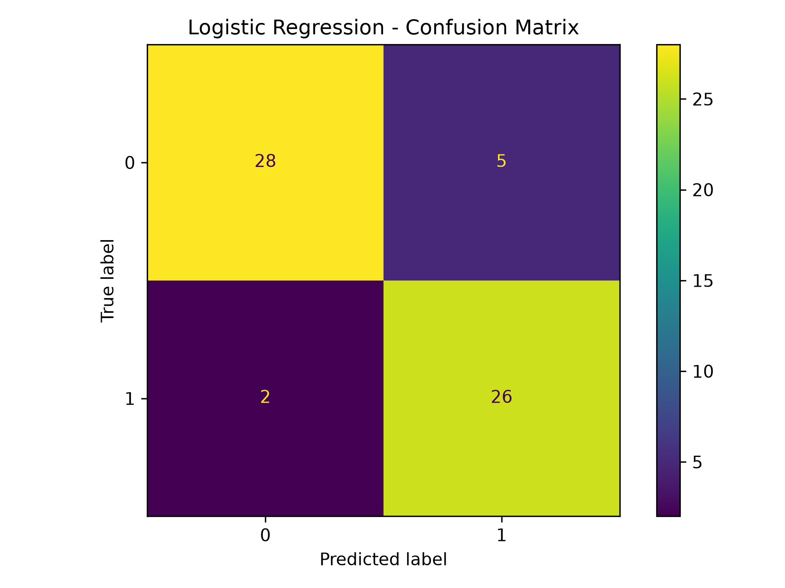
</p>

<p align="center"><b>Figure 5.</b> Logistic Regression confusion matrix.</p>

<p align="center">
  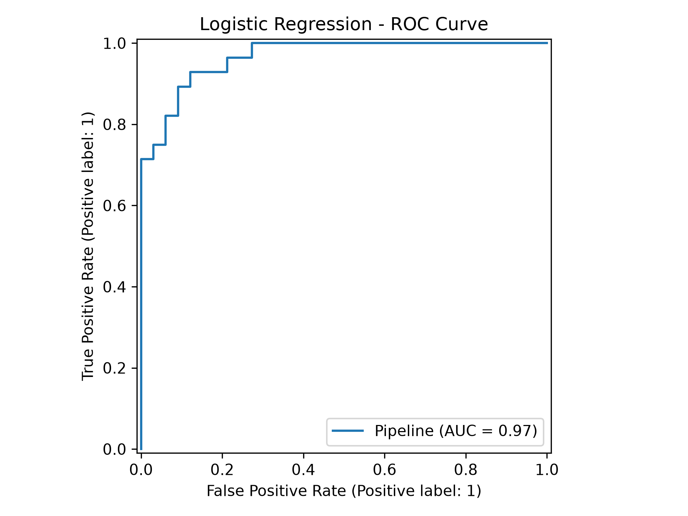
</p>

<p align="center"><b>Figure 6.</b> Logistic Regression ROC curve.</p>

<p align="center">
  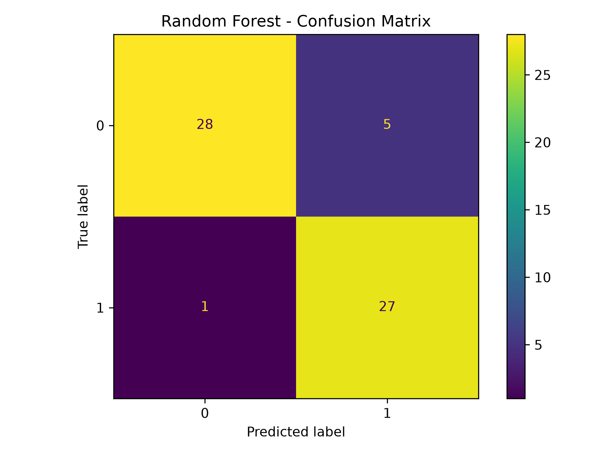
</p>

<p align="center"><b>Figure 7.</b> Random Forest confusion matrix.</p>

<p align="center">
  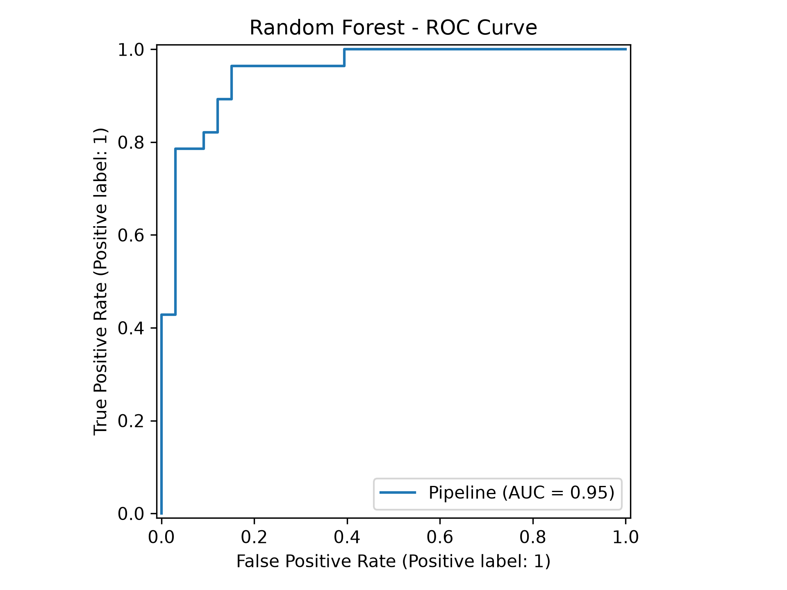
</p>

<p align="center"><b>Figure 8.</b> Random Forest ROC curve.</p>

<div style="page-break-after: always;"></div>

# 7. Experiment Tracking with MLflow

MLflow was used to track model training experiments. The experiment was named:

```text
heart_disease_classification
```

The following runs were logged:

| Run Name | Description |
|---|---|
| `logistic_regression` | Logistic Regression training and tuning |
| `random_forest` | Random Forest training and tuning |
| `final_selected_model` | Final selected model artifact and metadata |

## 7.1 Logged Items

For each model run, MLflow logged:

- Model name
- Hyperparameters
- Best GridSearchCV parameters
- Cross-validation ROC-AUC
- Test accuracy
- Test precision
- Test recall
- Test F1-score
- Test ROC-AUC
- Confusion matrix
- ROC curve
- Trained sklearn model pipeline

## 7.2 MLflow Evidence

<p align="center">
  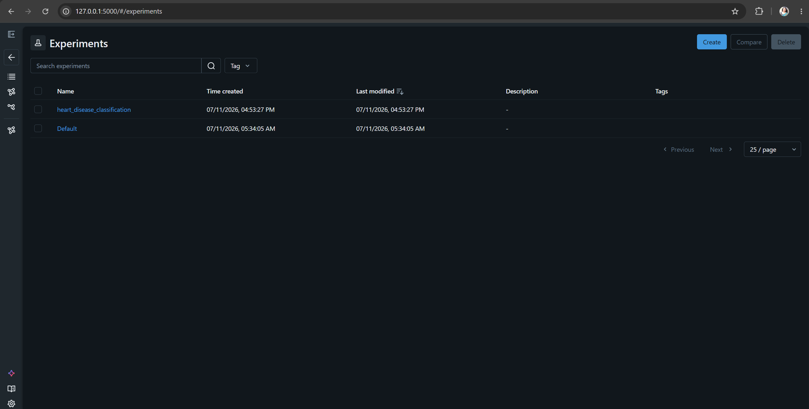
</p>
<p align="center"><b>Figure 9.a.</b> MLflow experiment list.</p>

<p align="center">
  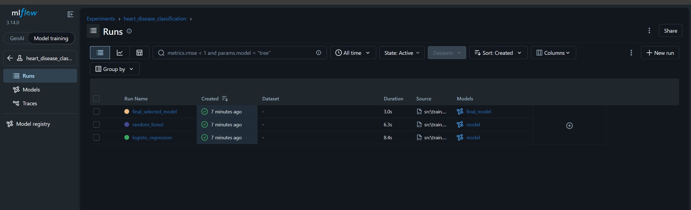
</p>
<p align="center"><b>Figure 9.b.</b> MLflow experiment list.</p>

<p align="center">
  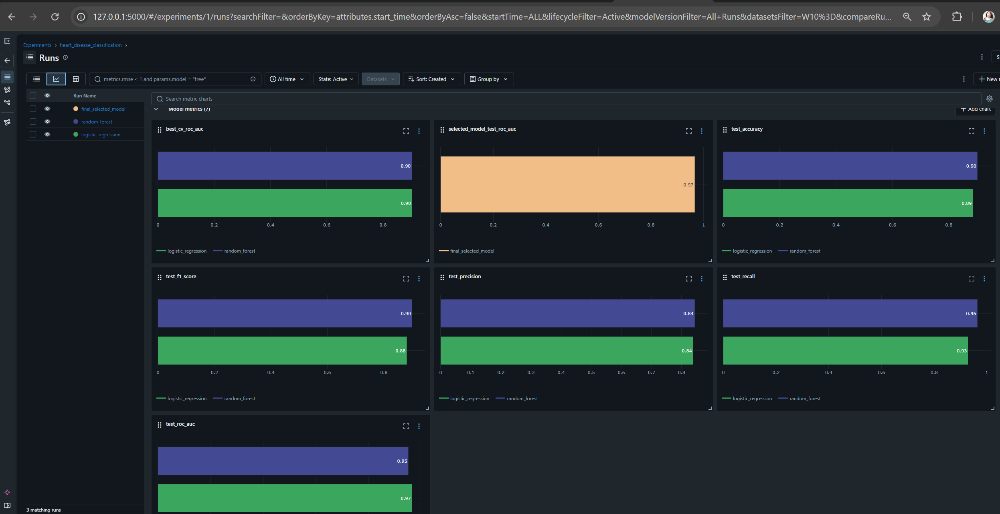
</p>
<p align="center"><b>Figure 10.</b> MLflow metrics comparison.</p>

<p align="center">
  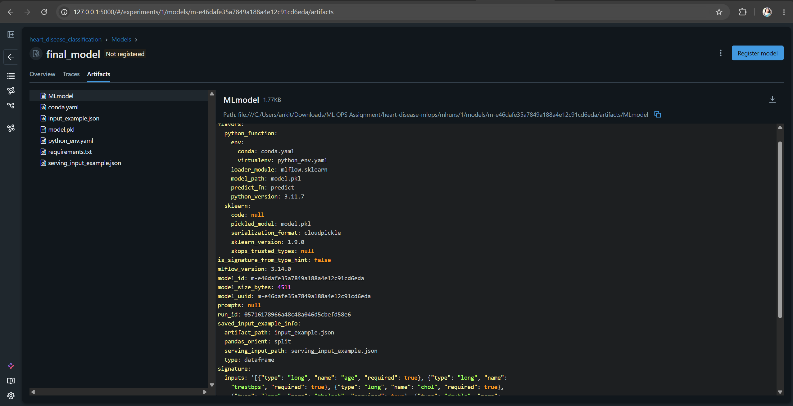
</p>
<p align="center"><b>Figure 11.a.</b> MLflow artifacts.</p>

<p align="center">
  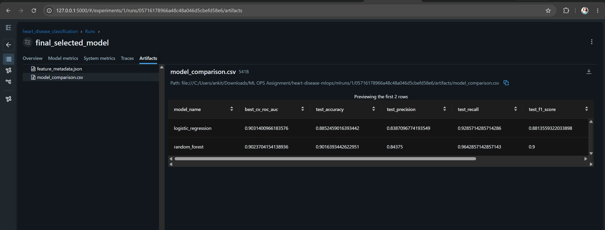
</p>
<p align="center"><b>Figure 11.b.</b> MLflow artifacts.</p>
<div style="page-break-after: always;"></div>

---

# 8. Model Packaging and Reproducibility

The final model was packaged as a complete sklearn pipeline and saved using Joblib:

```text
model/heart_disease_pipeline.joblib
```

Additional model package files:

| File | Purpose |
|---|---|
| `model/heart_disease_pipeline.joblib` | Saved preprocessing and trained model pipeline |
| `model/feature_metadata.json` | Feature list and selected model metadata |
| `model/sample_input.json` | Example input for local inference testing |

A standalone prediction script was created:

```text
src/predict.py
```

Example usage:

```bash
python src/predict.py --input model/sample_input.json
```

This confirms that the packaged model can be loaded and used independently outside the training script.

---

# 9. API Development

A FastAPI application was developed in:

```text
api/app.py
```

The API exposes the following endpoints:

| Endpoint | Method | Purpose |
|---|---|---|
| `/` | GET | API welcome message |
| `/health` | GET | Health check and model load status |
| `/predict` | POST | Heart disease prediction |
| `/metrics` | GET | Prometheus metrics |

## 9.1 Prediction Response

Example response from `/predict`:

```json
{
  "prediction": 0,
  "prediction_label": "heart_disease_absent",
  "heart_disease_probability": 0.3776,
  "confidence_probability": 0.6224
}
```
<p align="center">
  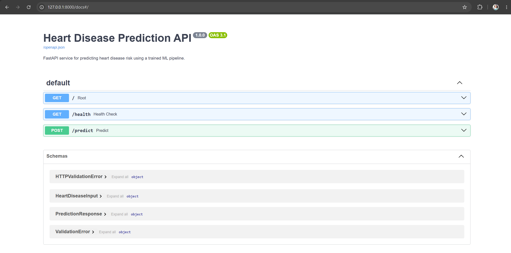
</p>

<p align="center"><b>Figure 12.</b> FastAPI Swagger UI.</p>

<div style="page-break-after: always;"></div>

# 10. Docker Containerization

The FastAPI model-serving application was containerized using Docker.

The Docker image includes:

- API code
- Trained model pipeline
- Source code
- Runtime dependencies
- Inference pipeline

A separate Docker requirements file was used:

```text
requirements-docker.txt
```

This avoids installing Windows-specific packages inside the Linux-based Docker image.

## 10.1 Docker Commands

Build the Docker image:

```bash
docker build -t heart-disease-api:latest .
```

Run the container:

```bash
docker run -d -p 8000:8000 --name heart-disease-api-container heart-disease-api:latest
```

Test the API:

```text
http://127.0.0.1:8000/docs
http://127.0.0.1:8000/health
```

## 10.2 Docker Evidence

<p align="center">
  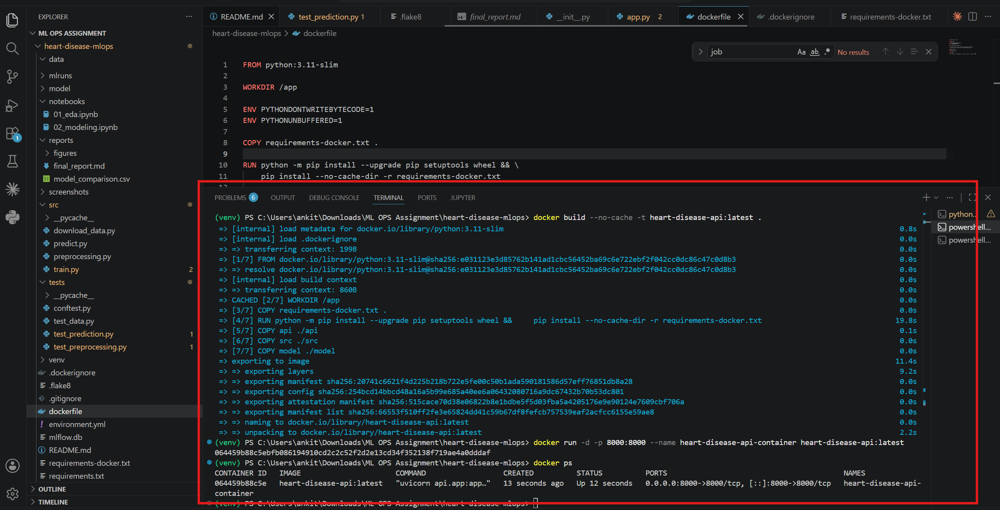
</p>

<p align="center"><b>Figure 13.</b> Docker image build success.</p>

<p align="center">
  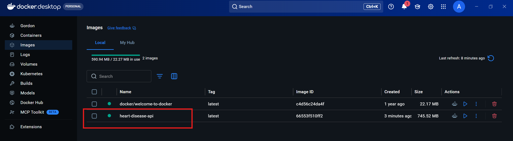
</p>

<p align="center"><b>Figure 14.</b> Docker container running locally.</p>

<p align="center">
  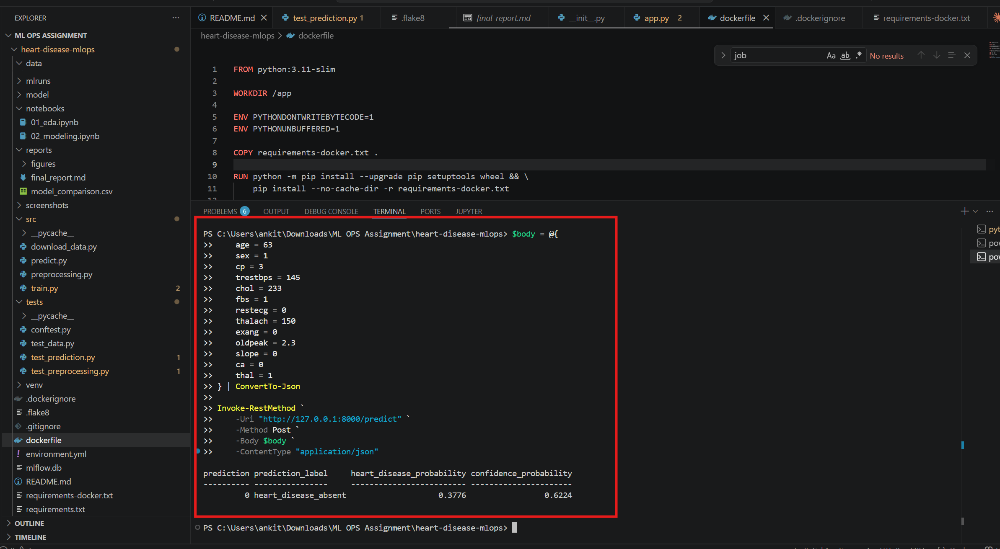
</p>

<p align="center"><b>Figure 15.</b> Dockerized API prediction response.</p>

---

# 11. CI/CD Pipeline and Automated Testing

CI/CD was implemented using GitHub Actions. Automated tests were implemented using Pytest, and code linting was implemented using Flake8.

The workflow file is located at:

```text
.github/workflows/ci.yml
```

## 11.1 Pipeline Steps

The GitHub Actions pipeline performs the following steps:

| Step | Description |
|---|---|
| Checkout | Pull repository code |
| Set up Python | Use Python 3.11 |
| Install dependencies | Install packages from requirements file |
| Lint | Run Flake8 |
| Data preparation | Download and prepare dataset |
| Model training | Train model pipeline |
| Prediction validation | Test saved model inference |
| Unit testing | Run Pytest test suite |
| Artifact upload | Upload model/report artifacts |

## 11.2 Unit Tests

Tests were created under the `tests/` folder.

The test suite validates:

- Processed dataset exists
- Target column exists
- Target is binary
- Dataset contains records
- Preprocessing pipeline can fit and transform data
- Model file exists
- Sample input exists
- Prediction output has the expected structure

Run tests locally:

```bash
python -m pytest tests -v
```

Run linting locally:

```bash
python -m flake8 src tests
```

## 11.3 CI/CD Evidence

<p align="center">
  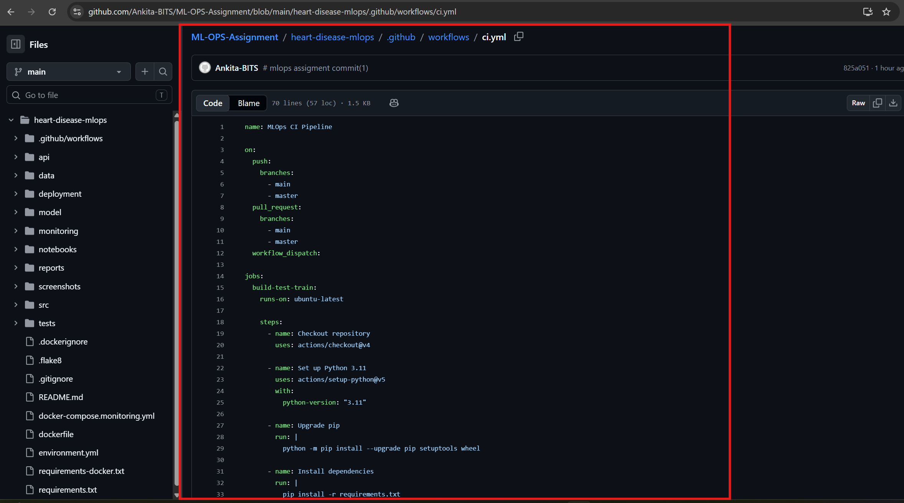
</p>

<p align="center"><b>Figure 16.</b> GitHub Actions workflow file.</p>

<p align="center">
  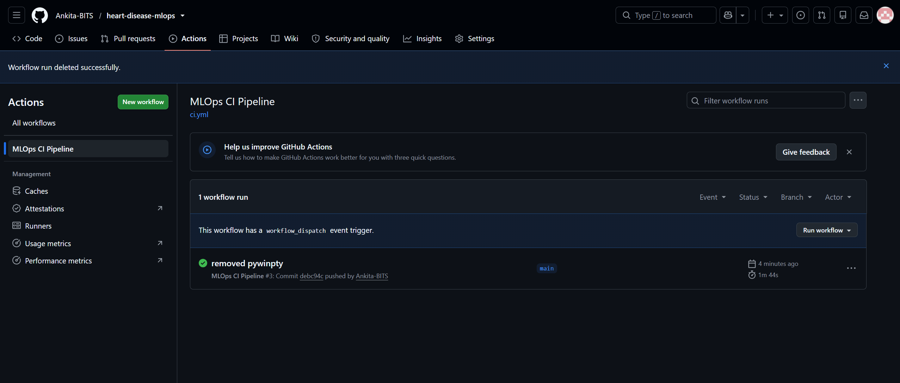
</p>

<p align="center"><b>Figure 17.a.</b> Successful CI/CD workflow run.</p>

<p align="center">
  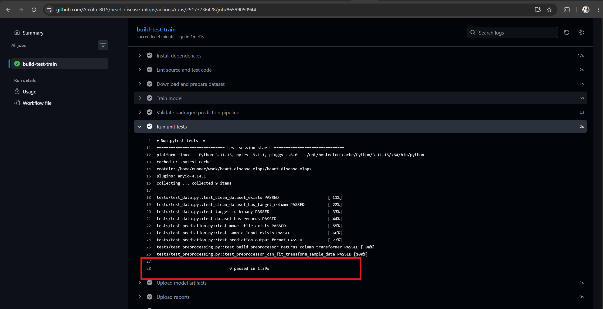
</p>

<p align="center"><b>Figure 17.b.</b> Github actions successful test logs.</p>

<p align="center">
  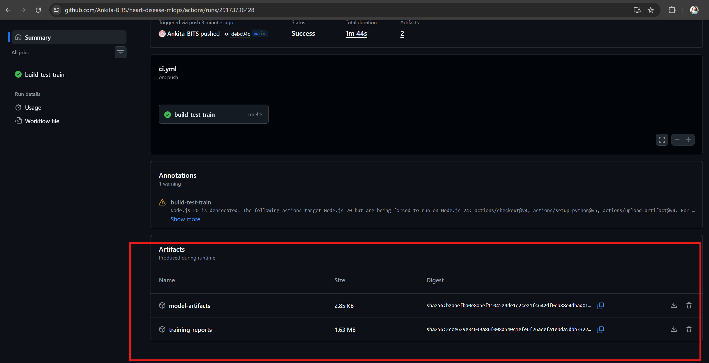
</p>

<p align="center"><b>Figure 17.c.</b> Github actions artifacts.</p>

<div style="page-break-after: always;"></div>

# 12. Kubernetes Deployment

The Dockerized API was deployed using local Kubernetes through Docker Desktop Kubernetes.

The deployment files are stored in:

```text
deployment/
```

| File | Purpose |
|---|---|
| `namespace.yaml` | Creates the `heart-disease` namespace |
| `deployment.yaml` | Deploys the FastAPI container |
| `service.yaml` | Exposes the API service |

## 12.1 Deployment Configuration

The Kubernetes deployment includes:

- Two API replicas
- Liveness probe using `/health`
- Readiness probe using `/health`
- LoadBalancer service on port `8000`

Apply deployment:

```bash
kubectl apply -f deployment/
```

Verify deployment:

```bash
kubectl get all -n heart-disease
kubectl get pods -n heart-disease
kubectl get svc -n heart-disease
```

If direct local access is unavailable, use port forwarding:

```bash
kubectl port-forward -n heart-disease service/heart-disease-api-service 8000:8000
```

## 12.2 Kubernetes Evidence

<p align="center">
  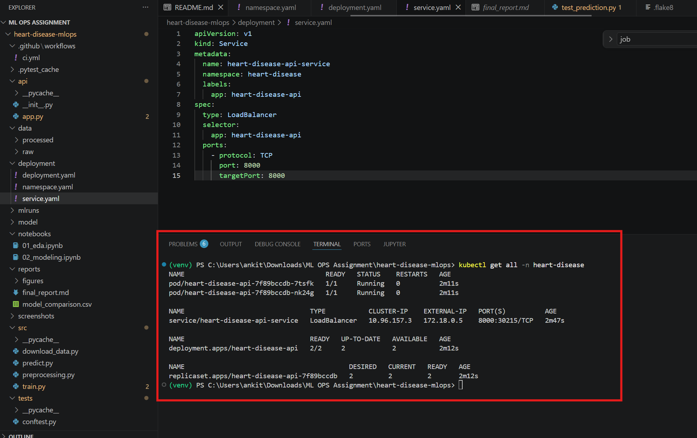
</p>

<p align="center"><b>Figure 18.</b> Kubernetes resources.</p>

<p align="center">
  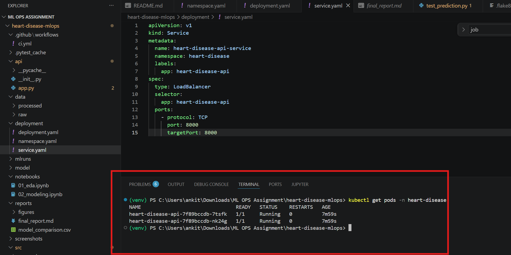
</p>

<p align="center"><b>Figure 19.</b> Kubernetes pods running.</p>

<p align="center">
  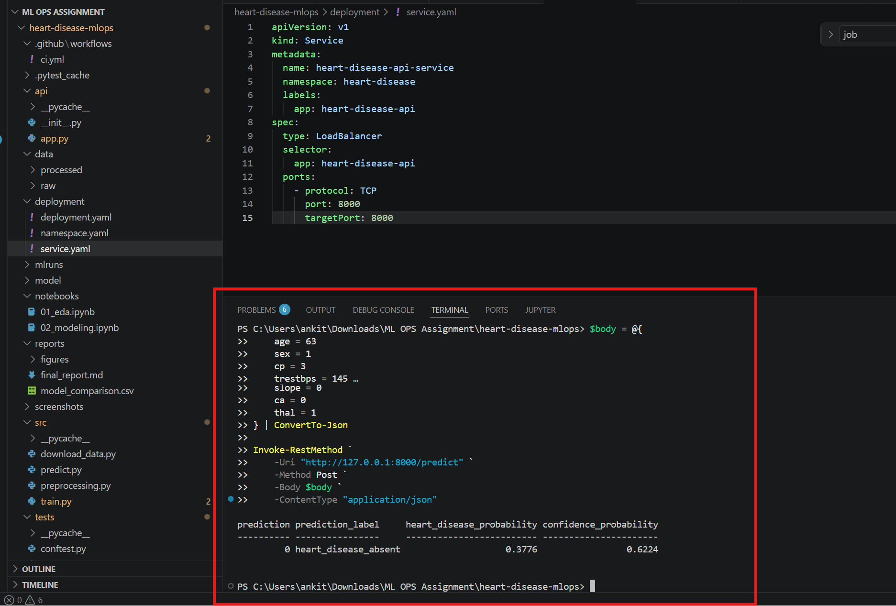
</p>

<p align="center"><b>Figure 20.</b> Kubernetes prediction endpoint response.</p>

---

# 13. Monitoring and Logging

Monitoring and logging were implemented for the API.

Monitoring files:

| File | Purpose |
|---|---|
| `monitoring/prometheus.yml` | Prometheus scrape configuration |
| `docker-compose.monitoring.yml` | Runs API, Prometheus, and Grafana |

## 13.1 Logging

The API logs:

- HTTP method
- Endpoint path
- Status code
- Request duration
- Prediction completion
- Heart disease probability

Example log pattern:

```text
request method=POST path=/predict status_code=200 duration_ms=...
prediction_completed prediction=0 heart_disease_probability=0.3776
```

## 13.2 Prometheus and Grafana

The API exposes Prometheus metrics at:

```text
/metrics
```

Prometheus scrapes this endpoint every 5 seconds. Grafana can be connected to Prometheus for dashboard visualization.

Monitoring URLs:

| Tool | URL |
|---|---|
| FastAPI | `http://127.0.0.1:8000/docs` |
| Metrics | `http://127.0.0.1:8000/metrics` |
| Prometheus | `http://127.0.0.1:9090` |
| Prometheus Targets | `http://127.0.0.1:9090/targets` |
| Grafana | `http://127.0.0.1:3000` |

## 13.3 Monitoring Evidence

<p align="center">
  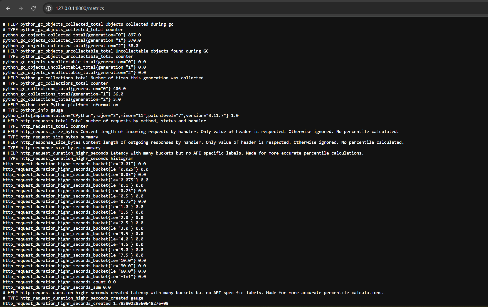
</p>

<p align="center"><b>Figure 21.</b> API metrics endpoint.</p>

<p align="center">
  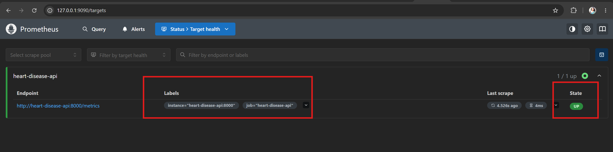
</p>

<p align="center"><b>Figure 22.</b> Prometheus target status.</p>

<p align="center">
  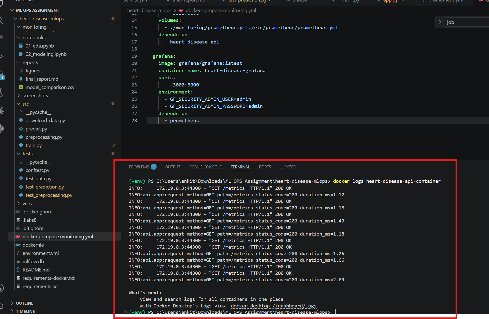
</p>

<p align="center"><b>Figure 23.</b> API request logs.</p>

<p align="center">
  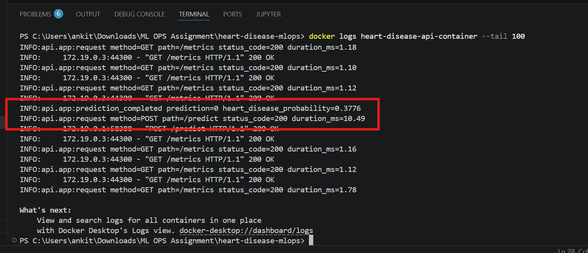
</p>

<p align="center"><b>Figure 24.</b> API prediction logs.</p>
<div style="page-break-after: always;"></div>

# 14. Setup and Run Instructions

## 14.1 Clone Repository

```bash
git clone https://github.com/Ankita-BITS/heart-disease-mlops
cd heart-disease-mlops
```

## 14.2 Create Virtual Environment

Command Prompt:

```bash
py -3.11 -m venv venv
venv\Scripts\activate.bat
```

PowerShell:

```powershell
.\venv\Scripts\Activate.ps1
```

## 14.3 Install Dependencies

```bash
python -m pip install --upgrade pip
pip install -r requirements.txt
```

## 14.4 Download Dataset

```bash
python src/download_data.py
```

## 14.5 Train Model

```bash
python src/train.py
```

## 14.6 Run Prediction Script

```bash
python src/predict.py --input model/sample_input.json
```

## 14.7 Run FastAPI Locally

```bash
python -m uvicorn api.app:app --host 127.0.0.1 --port 8000 --reload
```

Open:

```text
http://127.0.0.1:8000/docs
```

## 14.8 Run Tests

```bash
python -m pytest tests -v
```

## 14.9 Run Docker

```bash
docker build -t heart-disease-api:latest .
docker run -d -p 8000:8000 --name heart-disease-api-container heart-disease-api:latest
```

## 14.10 Run Kubernetes Deployment

```bash
kubectl apply -f deployment/
```

## 14.11 Run Monitoring Stack

```bash
docker compose -f docker-compose.monitoring.yml up --build
```

---

# 15. Deployment Access Instructions

The deployment was performed locally using Docker Desktop Kubernetes. Since this is a local deployment, there is no public cloud URL.

Local API access:

```text
http://127.0.0.1:8000/docs
```

If Kubernetes service access is not directly available, use:

```bash
kubectl port-forward -n heart-disease service/heart-disease-api-service 8000:8000
```

Then open:

```text
http://127.0.0.1:8000/docs
```

---

# 16. Implementation Challenges and Resolutions

| Challenge | Resolution |
|---|---|
| Python 3.14 compatibility issue | Recreated environment using Python 3.11 |
| MLflow filesystem backend warning | Used SQLite backend: `sqlite:///mlflow.db` |
| Docker build failed due to Windows dependency | Created `requirements-docker.txt` without `pywin32` |
| Local Kubernetes access | Used LoadBalancer and port-forwarding as needed |
| Prometheus logs dominated by `/metrics` requests | Filtered Docker logs to show prediction-specific logs |

---

# 17. Conclusion

This project successfully demonstrates an end-to-end MLOps workflow for heart disease prediction. The final system includes reproducible preprocessing, model training, experiment tracking, model packaging, API serving, containerization, automated testing, CI/CD, Kubernetes deployment, and monitoring.

The final trained model is served through a FastAPI API and can be executed locally, in Docker, or in Kubernetes. Prometheus metrics and API logs provide basic observability for the deployed service.

---

# 18. References

1. UCI Machine Learning Repository: Heart Disease Dataset.
2. Scikit-learn documentation.
3. MLflow documentation.
4. FastAPI documentation.
5. Docker documentation.
6. Kubernetes documentation.
7. Prometheus documentation.
8. Grafana documentation.
